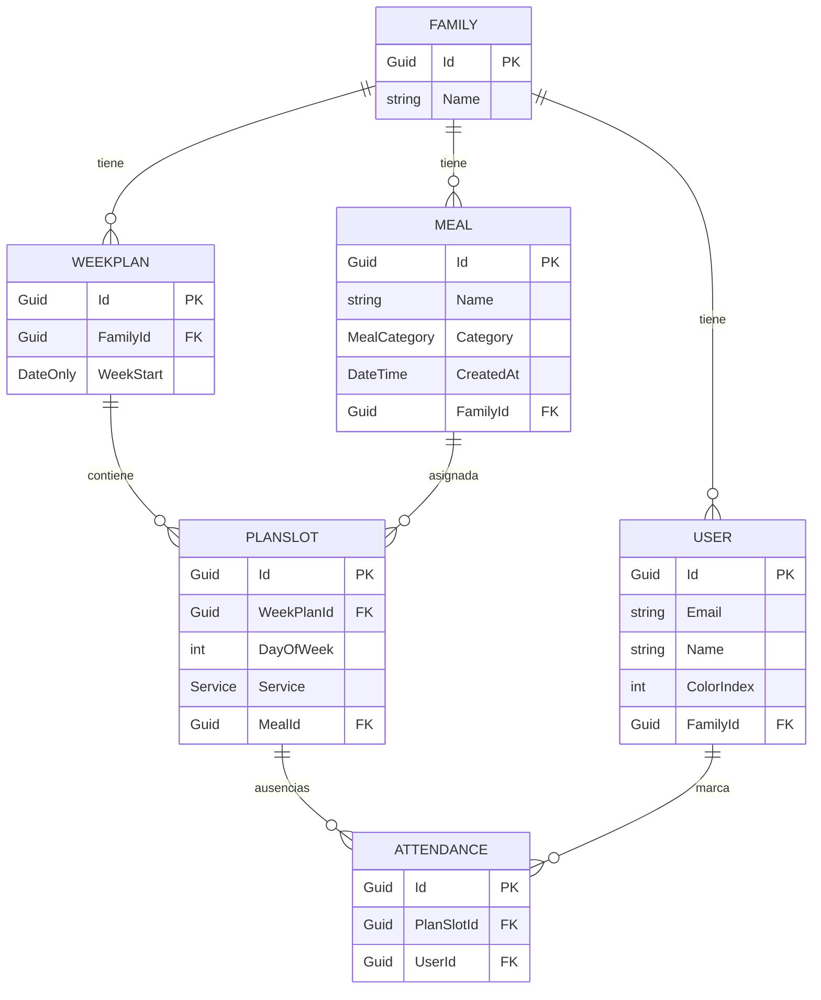
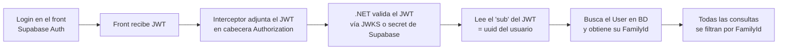

# 🍲 Puchero — Documento definitivo

> Planificador de comidas familiar. Genera menús semanales aleatorios y permite a cada miembro
> desapuntarse de comer o cenar en casa. Pensado para una familia, con el modelo preparado para
> escalar a varias en el futuro.

---

## 1. Objetivo

Una aplicación que:

- Genere automáticamente un **menú semanal** (comida + cena, de lunes a domingo) para que nadie tenga que pensar qué cocinar.
- Permita **re-rollear** un día/servicio concreto sin rehacer toda la semana.
- Incluya un **calendario de asistencia**: cada miembro puede marcar que un día, en una comida o cena concreta, **no come en casa**, para que quien cocina sepa para cuántos preparar.
- Esté **desplegada, funcionando y en uso real por la familia**.

---

## 2. Plataforma

**PWA (Progressive Web App) hecha con Angular.**

- Es una web normal que se "instala" en el móvil con un icono en la pantalla de inicio. Se abre a pantalla completa, sin barra del navegador. Para el usuario es indistinguible de una app nativa.
- **Cero publicación en stores** (ni Android ni iOS). Se despliega la web y listo.
- Soporta **push notifications vía Firebase Cloud Messaging** para la V4.
- ⚠️ Matiz iOS: las push en PWA solo funcionan si el usuario añade la web a la pantalla de inicio y tiene iOS 16.4+. No afecta al MVP (las notis son V4).

---

## 3. Stack y arquitectura general

| Capa            | Tecnología                                  |
|-----------------|---------------------------------------------|
| Frontend        | Angular (standalone, v17+) + TypeScript     |
| UI              | Angular Material                            |
| Estado          | Signals + servicios (sin NgRx)             |
| Hosting front   | Vercel                                       |
| Backend         | .NET + Entity Framework Core + CQRS (ligero, sin MediatR)|
| Hosting backend | Render (plan free)                           |
| Base de datos   | Supabase (PostgreSQL)                        |
| Autenticación   | Supabase Auth (email/password, JWT)         |

---

## 4. Modelo de datos

> Multi-tenant: **todas las tablas relevantes llevan `FamilyId` y todas las queries se filtran por él**,
> pero **no se construye UI de gestión de familias** en el MVP. Se siembra la familia a mano en la BD.
> Ids tipo `Guid` (para encajar con el uuid que asigna Supabase).



**Entidades:**

- **Family** — `Id`, `Name`.
- **User** — `Id` (= el uuid que asigna Supabase en el login), `Email`, `Name`, `ColorIndex` (0–4, tono del avatar), `FamilyId`.
- **Meal** — `Id`, `Name`, `Category` (enum `Lunch` / `Dinner` / `Both`), `CreatedAt`, `FamilyId`.
- **WeekPlan** — `Id`, `FamilyId`, `WeekStart` (lunes ISO de la semana).
- **PlanSlot** — `Id`, `WeekPlanId`, `DayOfWeek` (0 = lunes … 6 = domingo), `Service` (enum `Lunch` / `Dinner`), `MealId` (nullable). Cada semana son **14 slots** (7 días × 2 servicios).
- **Attendance** — `Id`, `PlanSlotId`, `UserId`. **Asistencia por ausencia**: por defecto todos comen; una fila aquí significa que ese usuario **NO** come en ese slot. `comensales = miembros − ausentes`.

**Convenciones:**

- La semana va de **lunes a domingo**; `WeekStart` es el lunes.
- La "semana actual" es la que **contiene el día de hoy**.
- La **categoría del plato manda en la generación**: un slot de comida solo admite platos `Lunch`/`Both`; uno de cena, `Dinner`/`Both`.
- En la BD, tablas y columnas en **snake_case** (vía EFCore.NamingConventions); los enums se guardan como **texto**.

---

## 5. Autenticación y multi-tenant

**Flujo:**



**Decisiones clave:**

- Login con **Supabase Auth** (email/password). Nada de auth manual: Supabase emite y firma el JWT; el .NET solo lo **valida**.
- **Tú pre-creas las cuentas** de los familiares desde el panel de Supabase (o un seed). Así ellos no pasan por registros ni confirmaciones de email; solo meten email + contraseña una vez y el navegador la recuerda.
- El JWT de Supabase **no trae el `FamilyId`** (es un concepto propio, no de Supabase). Por eso `User.Id` usa **el mismo uuid que Supabase**: en cada petición se lee el `sub` del token, se busca el `User` y se obtiene su `FamilyId`. Una query trivial, sin necesidad de configurar custom claims.

---

## 6. Arquitectura del backend (.NET)

**CQRS ligero** (separar lectura de escritura) sobre una base de capas finas. Sin event sourcing, sin doble base de datos — eso sería overengineering.

### Flujo

```
Cliente (Angular PWA)
        │  JWT
        ▼
API Controller (fino, solo enruta)
        │  inyecta y llama al handler directamente
   ┌────┴─────────────────────┐
   ▼ ESCRITURA                 ▼ LECTURA
Command handler            Query handler
(= tu capa de servicio)    (= tu capa de servicio)
   │                           │
   ▼                           ▼
DbContext directo          DbContext directo
(EF Core hace de repo +    + proyección a DTO (.Select())
 unit of work)             (se salta cualquier repo)
   │                           │
   └───────────┬───────────────┘
               ▼
        PostgreSQL (Supabase)
```

### Decisiones

- **Controller fino**: solo traduce HTTP ↔ command/query e invoca al handler correspondiente (inyectado por DI). Cero lógica.
- **El handler es la capa de servicio.** No hay una capa "Service" aparte que se solape con el handler.
- **Acceso a datos con `DbContext` directo en ambos lados** (lectura y escritura). **Sin capa de repositorio**: con EF Core, el `DbContext` ya es el Unit of Work y cada `DbSet<T>` ya es el repositorio. El handler **usa** EF Core; nunca hace de repositorio él mismo.
- **Lectura**: el query handler proyecta directo a DTO con `.Select()`.
- **Escritura**: el command handler carga la entidad, la muta y hace `SaveChangesAsync()`.
- **`WeekGenerator`** vive como **domain service**, invocado por el `GenerateWeekPlanHandler`.
- **Sin MediatR.** El controller llama al handler directamente (DI). Se mantiene la separación CQRS (handlers de Command/Query) sin la indirección ni la dependencia comercial de MediatR. Si en el futuro hicieran falta *pipeline behaviors* globales, migrar a MediatR es trivial porque los handlers ya están separados.

### Estructura de carpetas

```
/backend/Puchero/Puchero.Api   → un único proyecto Web API (.sln solo del backend)
  /Controllers      → controllers finos
  /Application
    /Commands       → CreateMeal, DeleteMeal, GenerateWeekPlan, RerollSlot, SetAttendance...
    /Queries        → GetCurrentWeek, GetMeals...
    /Dtos           → DTOs de respuesta
  /Domain
    /Entities       → entidades
    /Enums          → Service, MealCategory   (+ domain services como WeekGenerator)
  /Infrastructure
    /Auth           → ICurrentUser (sub del JWT → FamilyId) + config validación JWT Supabase
    PucheroDbContext.cs  (EF Core)
  /Migrations       → migraciones EF Core
```

### Secretos

- Connection string de Supabase, secret/JWKS del JWT, etc. → **siempre por variables de entorno**, nunca hardcodeados.

---

## 7. Arquitectura del frontend (Angular)

- **Standalone components** (v17+), sin el boilerplate de `NgModule`.
- **TypeScript** (tipado de punta a punta; las interfaces del front reflejan los DTOs del back).
- Estado con **signals + servicios**. Nada de NgRx.
- UI con **Angular Material** (lista, botones y, sobre todo, el datepicker para el calendario).

### Estructura de carpetas

```
/frontend/src/app
  /core
      auth.service.ts        → cliente de Supabase (login)
      api.service.ts         → cliente HTTP hacia el .NET
      jwt.interceptor.ts     → adjunta el JWT en cada petición  ← pegamento front/back
      auth.guard.ts          → protege rutas
  /features
      /auth                  → pantalla de login
      /meals                 → listar, crear y borrar comidas
      /week                  → vista semanal: menú (lunes-domingo, comida/cena) + re-roll
                               + asistencia integrada (bottom sheet "¿Quién come?")
  /shared
      /components            → reutilizables
      /models                → interfaces TS que reflejan los DTOs del backend
```

### Pantalla de carga (cold start)

Como el backend usa el plan free de Render (ver §9), tras un rato sin uso el primer acceso tarda ~30-60s en "despertar". Para que la experiencia sea buena, el front muestra una **pantalla de carga maja** ("Preparando el menú…" con un spinner) mientras el back arranca, en vez de una pantalla en blanco.

---

## 8. API (endpoints)

Todas las rutas (salvo `/health`) requieren el JWT de Supabase; el `FamilyId` se deriva del usuario del token. **Sin prefijo `/api`.**

| Método   | Ruta                                       | Descripción |
|----------|--------------------------------------------|-------------|
| `GET`    | `/meals`                                   | Lista las comidas del pool de la familia. |
| `POST`   | `/meals`                                   | Crea una comida. Body: `{ name, category }`. |
| `DELETE` | `/meals/{id}`                              | Elimina una comida del pool. |
| `POST`   | `/weekly-plan/generate`                    | Genera la semana actual (14 slots). |
| `GET`    | `/weekly-plan/current`                     | Devuelve el menú de la semana actual **+ la asistencia de toda la familia** (una sola llamada). |
| `PUT`    | `/weekly-plan/slots/{slotId}/reroll`       | Cambia la comida de un slot concreto. |
| `PUT`    | `/weekly-plan/slots/{slotId}/attendance`   | Marca asistencia de un miembro en un slot. Body: `{ userId, eats }`. Dispositivo compartido: cualquiera puede marcar a cualquiera. |
| `GET`    | `/health`                                  | Endpoint tonto (200 OK) para el cron anti-sleep de Render. |

---

## 9. Lógica de negocio

### Generar semana

- Se generan **14 slots** (7 días × comida + cena).
- Para cada slot se elige al azar un plato **elegible para ese servicio** (comida → `Lunch`/`Both`; cena → `Dinner`/`Both`) que **no se haya usado ya esa semana** (sin repetir).
- Si no quedan platos elegibles sin usar para un servicio, se permite **repetir lo mínimo imprescindible** en vez de fallar. Así siempre se genera.
- 💡 Para una semana sin repetir hacen falta **≥7 platos elegibles por servicio** (los `Both` cuentan en ambos). Recomendado tener 20-25 platos.

### Re-roll

- Reemplaza **un único slot**.
- La nueva comida debe ser **elegible para el servicio de ese slot** y, a ser posible, **distinta a las que ya están en la semana** y a la actual.

### Asistencia

- Por defecto, todos comen en casa; solo se persiste **quién no come** (una fila `Attendance` por ausencia).
- Se marca **por slot**. Al ser un **dispositivo compartido en casa**, cualquiera puede marcar la asistencia de cualquiera.
- El menú y la asistencia son **independientes**: el planner decide *qué* se cocina; la asistencia dice *para cuántos*. Se muestran juntos en la pantalla de Semana.

---

## 10. Hosting y "always-on"

| Parte         | Plataforma          |
|---------------|---------------------|
| Frontend      | Vercel (siempre activo) |
| Backend       | Render (plan free)  |
| DB + Auth     | Supabase            |

**Sobre el "sleep" del backend (Render free):**

- Tras ~15 min sin actividad, el servicio se duerme. La siguiente petición lo despierta sola (no hay que hacer nada manual), pero ese arranque tarda ~30-60s.
- **Mitigación elegida:**
  1. Endpoint `GET /health` que devuelve `200 OK`.
  2. **cron-job.org** (gratis): un cronjob que llama a `https://<tu-backend>.onrender.com/health` **cada 10 min**, para que nunca pase 15 min sin actividad → nunca se duerme.
  3. La pantalla de carga del front (§7) como red de seguridad por si acaso.
- Si en algún momento molesta, el salto a Render/Railway de pago (~5 $/mes, sin sleep) es trivial.

**Notas:**

- El **sleep solo afecta al backend**. Vercel (front) y los datos en Supabase no se ven afectados.
- El plan free de Supabase pausa la BD tras ~1 semana sin **ninguna** actividad; con uso familiar semanal real no se llega a eso.

---

## 11. Roadmap

### 🥇 V1 (MVP)
- Login (Supabase)
- CRUD de comidas (crear + listar)
- Generar semana
- Re-roll de slot
- Calendario de asistencia (desapuntarse)
- Deploy funcional

### 🥈 V2
- Historial de semanas
- Categorías de comida
- Evitar comidas recientes

### 🥉 V3
- Favoritos
- Preferencias
- Lista de la compra automática

### 🧠 V4 (pro)
- IA para sugerencias
- Notificaciones (Firebase Cloud Messaging)
- Multiusuario completo (invitar familiares + UI de gestión de familias)

---

## 12. Decisiones importantes

**✅ Sí hacer**
- Código limpio y lógica clara
- CQRS ligero (separar lectura/escritura)
- `FamilyId` en el modelo desde el día 1
- Deploy funcional
- UX simple
- Secretos por variables de entorno

**❌ No hacer**
- Auth manual
- MediatR (CQRS sin mediador: el controller llama al handler directamente)
- Microservicios / Kubernetes
- Repositorio genérico sobre EF Core
- NgRx
- UI de gestión de familias en el MVP
- Overengineering en general

---

## 13. Orden de implementación sugerido

1. **Supabase**: crear proyecto, habilitar Auth, crear las cuentas de la familia a mano, sembrar `Family` y los `User` (con el uuid de Supabase como `Id`).
2. **Backend base**: proyecto .NET, EF Core apuntando a Supabase, entidades + migración inicial, validación del JWT de Supabase, endpoint `/health`.
3. **CRUD de comidas**: `GET /meals`, `POST /meals` (filtrando por `FamilyId`).
4. **Generar semana**: `WeekGenerator` (domain service) + `POST /weekly-plan/generate` + `GET /weekly-plan/current`.
5. **Re-roll**: `PUT /weekly-plan/slots/{slotId}/reroll`.
6. **Asistencia**: `PUT /attendance` + incluir la asistencia en `GET /weekly-plan/current`.
7. **Frontend**: login + interceptor JWT, vista del planner, gestión de comidas, calendario de asistencia, pantalla de carga.
8. **Deploy**: front a Vercel, back a Render, cron-job.org sobre `/health`.
9. **Probar con la familia** 🎉

---

## 🎯 Objetivo final

Una app que **esté desplegada, funcione, y la use tu familia**.
